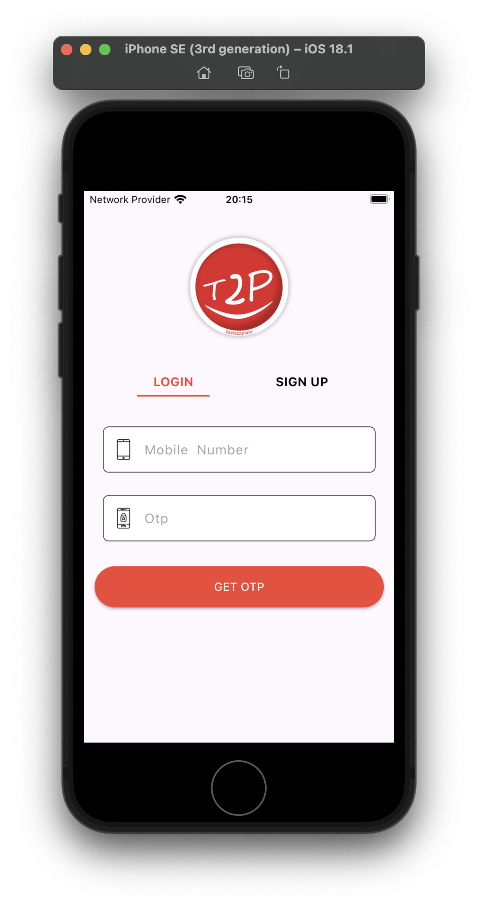
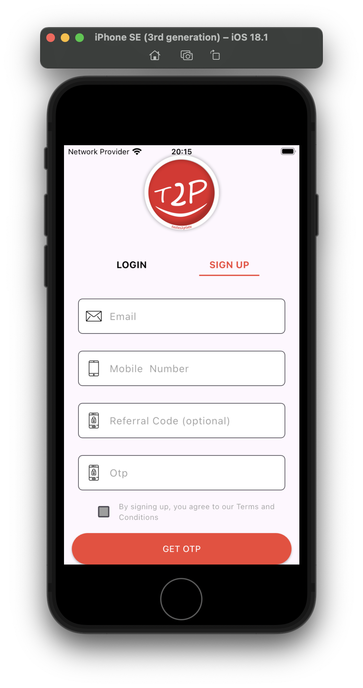
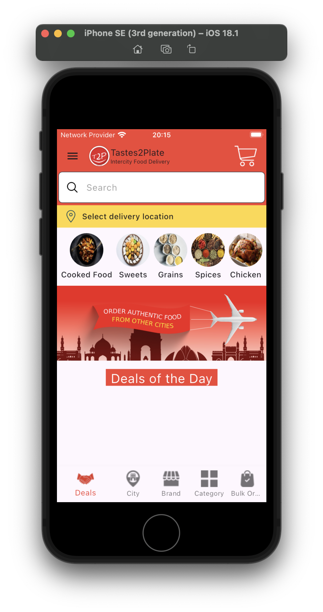

# 🍽️ Taste2Plate

Taste2Plate is a Flutter-based food ordering app that allows users to browse and order food online seamlessly. The app is built using the **MVC architecture** with **GetX** for state management.

## 🌟 Features

- 🍕 Browse a variety of food options
- 🛒 Add items to cart and place orders
- 🎨 User-friendly UI with smooth animations
- 🔄 API integration for fetching live data
- 🎠 Carousel slider for featured items
- ⚡ Lightweight and optimized for performance

## 🏗️ Architecture

The app follows the **MVC architecture**:

```
📂 taste2plate/
 ├── 📁 lib/
 │   ├── 📁 controllers/   # GetX controllers for state management
 │   ├── 📁 models/        # Data models
 │   ├── 📁 views/         # UI screens
 │   ├── 📁 widgets/       # Reusable UI components
 │   ├── 📁 services/      # API call handlers
 │   ├── 📄 main.dart      # Entry point of the app
```

## 📦 Packages Used

```yaml
dependencies:
  cupertino_icons: ^1.0.2
  get:
  http: ^1.3.0
  carousel_slider: ^5.0.0
```

## 📸 Screenshots

|:-------------------------:|:-------------------------:|:-------------------------:|:-------------------------:|
|||||
|:-------------------------:|:-------------------------:|:-------------------------:|:-------------------------:|

## 🚀 How to Run

1. Clone the repository:
   ```bash
   git clone https://github.com/yourusername/taste2plate.git
   cd taste2plate
   ```
2. Install dependencies:
   ```bash
   flutter pub get
   ```
3. Run the app:
   ```bash
   flutter run
   ```

## 📜 License

This project is licensed under the MIT License.

---
